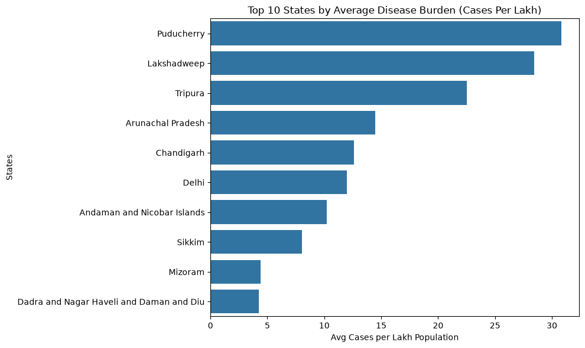
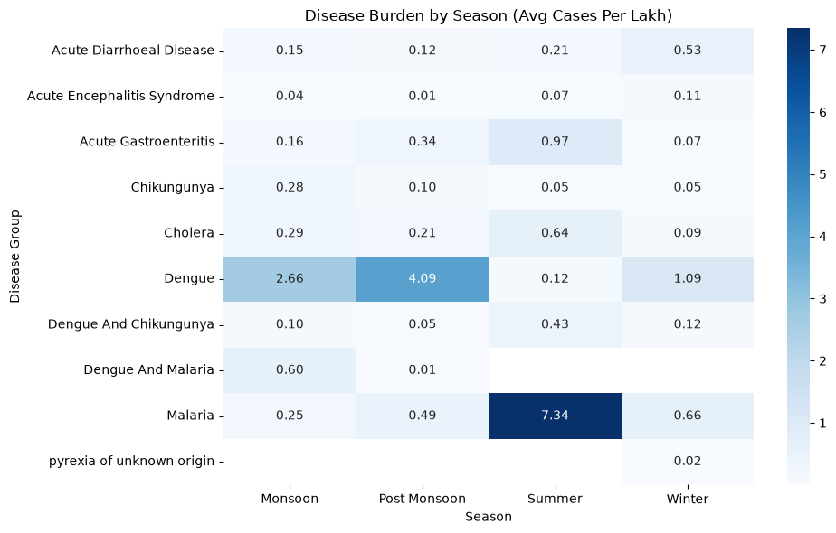
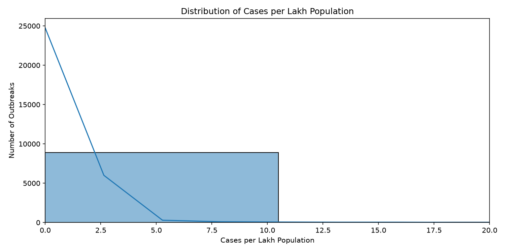

# India Disease Surveillance Analytics

> Which states in India carry the highest communicable disease burden — and how have outbreak patterns shifted across seasons and years? Where should public health resources be prioritized?

---

## Dataset Sources

| Dataset | Description | Source |
|---------|-------------|--------|
| **EpiClim** (Primary) | District-level weekly outbreak data across India, 2009–2022 — includes disease type, cases, deaths, location, and climate variables (temperature, rainfall, LAI) | [Zenodo](https://zenodo.org/records/14580510) |
| **State Population** | 2024 Aadhaar-based population estimates for all 36 states and union territories | [Wikipedia](https://en.wikipedia.org/wiki/List_of_states_and_union_territories_of_India_by_population) |

---

## Technical Stack

| Tool | Usage |
|---|---|
| **Python** | Automated the end-to-end ETL data pipeline |
| **Pandas** | Cleaned 22+ disease variants into 10 categories and handled nulls |
| **NumPy** | Calculated array operations and population-normalized metrics |
| **Matplotlib** | Visualized initial exploratory disease case distributions |
| **Seaborn** | Analyzed outbreak trends across seasons and years |
| **MySQL** | Stored normalized data and executed complex analytical queries |
| **SQLAlchemy** | Automated batch loading of DataFrames into MySQL |
| **Power BI** | Built interactive dashboards for regional burden and seasonal trends |

---

## ETL Pipeline

```
| ETL Step | Description | Tool |
|---|---|---|
| **Extract** | Read Raw Data | **Python (Pandas)** |
| **↓** | | |
| **Transform** | Clean and Structure | **Python (Pandas)** |
| **↓** | | |
| **Load** | Write to Database | **SQLAlchemy** |
| **↓** | | |
| **Storage** | Relational DB | **MySQL** |
| **↓** | | |
| **Analyze** | Business Logic | **SQL** |
| **↓** | | |
| **Visualize** | Dashboarding | **Power BI** |

```

The pipeline is implemented across three files:

- **`etl_pipeline.ipynb`** — Extracts raw CSVs, applies all transformations, exports processed `epiclem.csv`
- **`load_to_mysql.py`** — Loads processed data into MySQL via SQLAlchemy *(excluded from repo for security)*
- **`queries.sql`** — Five analytical queries run against the MySQL database

---

## Key Transformations

| Transformation | Detail |
|----------------|--------|
| **Disease name standardization** | 22+ raw variations (e.g. `Suspected Dengue`, `Dengue Fever`, `Dengue/Chikungunya`) mapped to 10 clean categories including co-infection groups like `Dengue And Chikungunya` |
| **Missing Deaths handling** | 71% of the `Deaths` column was null (6,431 / 8,985 rows). Filled with `0` for aggregation purposes. An `Available_Deaths` boolean flag tracks which rows had original death data, enabling honest CFR calculations downstream |
| **State name mismatch fix** | `Dadra and Nagar Haveli` and `Daman and Diu` merged into `Dadra and Nagar Haveli and Daman and Diu` to match the population dataset |
| **Cases_Per_Lakh computation** | `(Cases / Population_2024) * 100,000` — normalizes case counts by population for fair cross-state comparison |
| **Season column** | Month mapped to four seasons: **Winter** (Dec–Feb), **Summer** (Mar–May), **Monsoon** (Jun–Sep), **Post Monsoon** (Oct–Nov) |
| **Climate column imputation** | Missing values in `Temp`, `preci`, `LAI` filled first by state+month group median, then by global median as fallback |

---

## Key Insights

- **Acute Diarrhoeal Disease** is the most reported disease with **5,126 outbreaks** — over 57% of all records
- **2016** was the peak outbreak year (1,113 records), while **2020** saw a sharp drop (151 records), likely due to COVID-19 surveillance displacement
- **Maharashtra** (1,195), **Karnataka** (1,097), and **West Bengal** (889) report the highest outbreak counts
- **Monsoon season** carries the heaviest disease burden, with Acute Diarrhoeal Disease and Cholera peaking during and after rains
- Small states/UTs like **Puducherry**, **Lakshadweep**, and **Chandigarh** show disproportionately high Cases Per Lakh due to smaller populations

### EDA Visualizations

**Top 10 States by Average Disease Burden**


**Seasonal Disease Burden (Avg Cases Per Lakh)**


**Distribution of Cases Per Lakh Population**


---

## SQL Analysis

Five analytical queries in [`sql/queries.sql`](sql/queries.sql):

| # | Query | Description |
|---|-------|-------------|
| 1 | **State-wise Disease Burden** | Aggregates total cases, avg cases per lakh, deaths, and outbreak count per state and disease group |
| 2 | **Seasonal Disease Pattern** | Shows avg burden and affected states by season and disease — reveals monsoon-driven spikes |
| 3 | **Resource Prioritization (CFR)** | Calculates case fatality rate (CFR%) per state-disease using only rows with reported deaths (`Available_Deaths = 1`) |
| 4 | **Year-over-Year Outbreak Pattern** | Tracks annual case counts and affected states per disease — surfaces epidemic trends over 2009–2022 |
| 5 | **Climate Correlation Check** | Cross-references avg temperature, rainfall, and disease burden by season and disease group |

---

## Project Structure

```
disease_surveillance/
├── data/
│   ├── raw/
│   │   ├── Final_data.csv           # Raw EpiClim outbreak data (8,985 rows × 15 cols)
│   │   └── state_population.csv     # 2024 population estimates (36 states/UTs)
│   └── processed/
│       ├── epiclem.csv              # Cleaned output from ETL pipeline
│       └── Theme.json               # Power BI theme configuration
├── images/
│   ├── distribution.png             # Cases per lakh distribution histogram
│   ├── seasonal_disease_burden.png  # Season × Disease heatmap
│   └── top10_states.png            # Top 10 states bar chart
├── notebooks/
│   ├── analysis.ipynb               # EDA visualizations (3 charts)
│   ├── eda.ipynb                    # Exploratory data analysis
│   └── etl_pipeline.ipynb           # Extract, transform, load pipeline
├── sql/
│   └── queries.sql                  # 5 analytical SQL queries
├── .gitignore
└── README.md
```

---

## Dashboard Status

Power BI dashboard is currently **in progress**. ETL pipeline, SQL analysis, and EDA are complete.

---

## Limitations

- **EpiClim data ends in 2022** — no post-COVID surveillance trends captured
- **Deaths data is 71% missing** — CFR analysis is performed only on the available subset (`Available_Deaths = 1`), which may introduce reporting bias
- **Population estimates are projected** (Aadhaar-based, 2024) — not census-verified; actual mid-year populations for 2009–2022 may differ

---

## Author

**Payal Jain**
[github.com/Payaljain05](https://github.com/Payaljain05) · payaljain1503@gmail.com
